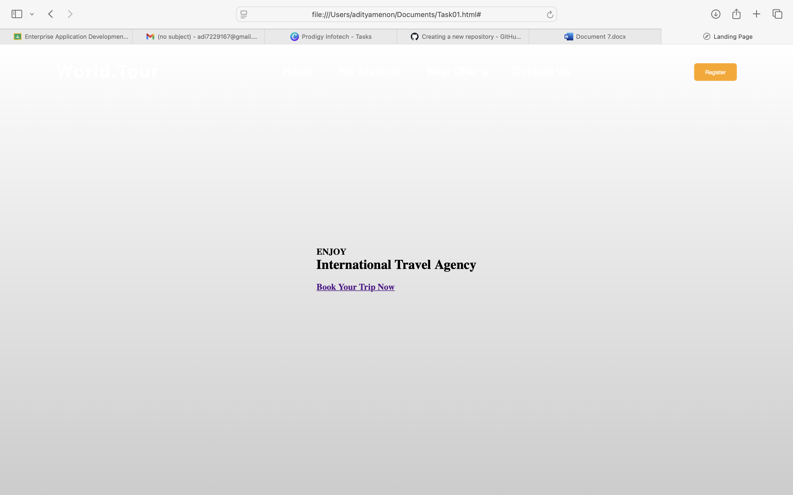

# PRODIGY_WD_01 - Landing Page

## 📌 Description
This repository contains **Task 01** of my Prodigy Infotech Web Development Internship.  
The task was to **create a responsive landing page** using HTML and CSS.

The page represents a **Travel Agency Landing Page** with navigation, hero section, and a call-to-action button.

---

## ✨ Features
- Navigation bar with hover underline animation  
- Hero section with background image  
- Call-to-action button: *Book Your Trip Now*  
- Responsive layout for better viewing on different screens  

---

## 🖼️ Output Screenshot


---

## 🚀 How to Run
1. Clone the repository:
   ```bash
   git clone https://github.com/aditya1027dev/PRODIGY_WD_01.git
